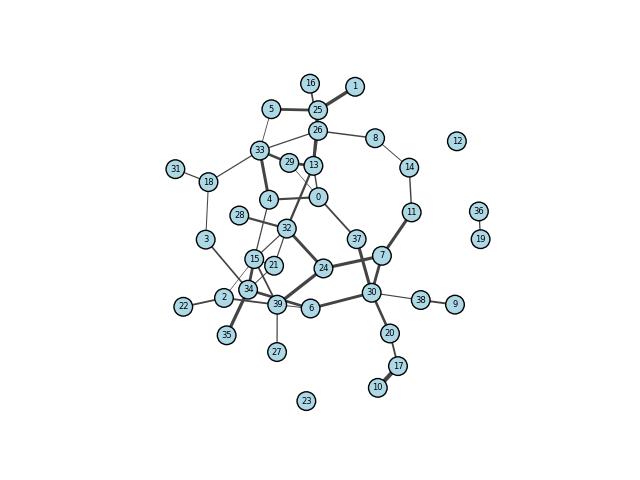

# Final Project

## Problem

Given a graph with `n` nodes and `m` edges, where each edge has a weight in the
form of a random distribution, find the shortest path from a given node to another.

    Note: It turns out this kind of problem has a name. This is a stochastic shortest path problem.

There will be `x` number of solvers that will be trying to find the shortest path
from a random start and end node. Each time a solver finds a path, the edge weights
along that path will be updated to reflect the traffic that the solver caused.

The solvers are split into three groups, each with a different set of rules to follow:

1. **Group 1**: The solvers in this group only get the information that they gather
   themselves in past rounds.

2. **Group 2**: The solvers in this group also get the information that they gather
   themselves in past rounds, but they also get the information that the solvers in
   group 1 gathered in past rounds.

3. **Group 3**: The solvers in this group get access to the exact edge values for
   each round. They also are the last group to make a decision so they can see all
   the traffic information as well.

## Proposed Solutions

### Epsilon Greedy (Multi-Armed Bandit)

If we treat every complete path from the start to the end node as a slot machine,
then we can use the epsilon greedy approach to find the best path after several
rounds of exploration.

I had to make a few implementation decisions to make this work:

1. **If there are many paths, should they all be explored?**

   I decided to sort the paths by nuumber of edges and only explore the shortest
   25 paths. I did this because the number of paths grow exponentially with the
   number of nodes and it was not feasible to explore all of them.

2. **How do we decide which path to explore?**

   Obviously this is the epsilon greedy so I had an epsilon value that would
   determine if we should explore or exploit. On exploit, it takes the path with
   the lowest Q value (instead of the normal largest value). On explore, it just
   picks a random path from the list of paths. The epsilon value is decreased
   after each round so as to start exploiting more and more.

3. **How do we implement this with the three solver groups and each choice directly
   effecting the edge weights?**

   I decided to have each group of solvers make a choice and update the edge weights
   immedietly. Groups 1 and 2 could make choices at the same time, then group 3
   would make a choice last. Once all the choices were made, the rewards would be
   calculated (total length of path) and the Q values would be updated. Group 2
   would have the Q updated from it's own action/reward and the action/reward
   from group 1. Group 3 doesn't have a Q because it is just a normal shortest
   path algorithm.

### Monte Carlo Markov Chain (MCMC)
